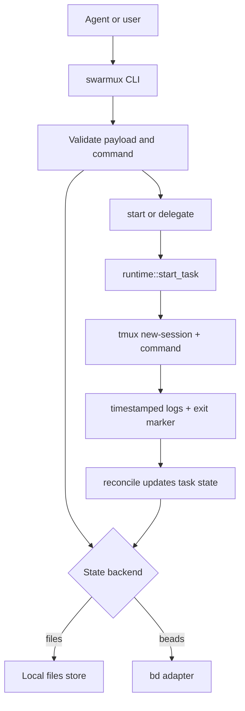

# swarmux

Agent-first tmux swarm orchestration for local coding tasks.

`swarmux` gives coding agents a narrow control plane for submitting, starting, inspecting, steering, reconciling, and pruning local work. Humans keep tmux visibility; agents get machine-readable commands and strict input validation.

## Requirements

- `tmux`
- `git`
- a POSIX shell at `/bin/sh`
- optional: `bd` when `SWARMUX_BACKEND=beads`

## Install

For now, install from source:

```bash
cargo install --path .
```

If you use the optional beads-rust backend and only have `br` installed, add a `bd` shim.

## Quick start

```bash
swarmux doctor
swarmux init
swarmux --output json schema
swarmux --output json submit --json '{
  "title": "hello",
  "repo_ref": "demo",
  "repo_root": "/path/to/repo",
  "mode": "manual",
  "worktree": "/path/to/repo",
  "session": "swarmux-demo",
  "command": ["codex","exec","-m","gpt-5.3-codex","echo hi from task"]
}'
swarmux --output json list
swarmux overview --once
```

tmux-friendly dispatch without JSON quoting:

```bash
swarmux --output json dispatch \
  --title "hello" \
  --repo-ref demo \
  --repo-root /path/to/repo \
  -- codex exec -m gpt-5.3-codex "echo hi from task"
```

Connected dispatch from the current tmux pane:

```bash
swarmux --output json dispatch \
  --connected \
  --mirrored \
  --prompt "fix tests" \
  -- codex exec
```

Configured default connected command:

```toml
# ~/.config/swarmux/config.toml
[connected]
runtime = "mirrored"
command = ["codex", "exec"]
```

```bash
swarmux --output json dispatch --connected --prompt "fix tests"
```

Configured named agent runners:

```toml
# ~/.config/swarmux/config.toml
[connected]
agent = "codex"
runtime = "mirrored"

[agents.codex]
command = ["codex", "exec"]

[agents.claude]
command = ["claude", "-p"]
```

```bash
swarmux --output json dispatch --connected --agent claude --prompt "summarize diff"
```

tmux binding for connected dispatch:

```tmux
bind-key D command-prompt -p "Task" "run-shell 'swarmux --output json dispatch --connected --pane-id \"#{pane_id}\" --prompt \"%1\"'"
```

`headless` remains the default runtime when no override is configured. `mirrored` keeps the agent process visible in the task session and mirrors pane output into logs. A true app-level TUI mode is separate and planned later; for example `codex exec` in `mirrored` mode is still the CLI runner, not the full `codex` TUI.

## How it works

`swarmux` stores task state in either `files` (default) or `beads` (`SWARMUX_BACKEND=beads`), but runtime execution is always tmux-driven and command-agnostic. The `command` array from `submit` is executed as-is inside a tmux session.



For completion notifications, use `swarmux notify --tmux` for one-shot delivery or `swarmux watch --tmux` for a foreground polling loop that reconciles and emits `tmux display-message` when tasks enter terminal states.

`watch`/`notify` also include a compact completion excerpt from the task output:

```text
swarmux 4rh succeeded what is the time currently ...current time is 23:14:05
```

```text
2026-03-14T10:22:31Z spawned swx-swarmux-4rh
2026-03-14T10:22:35Z current time is 23:14:05
```
